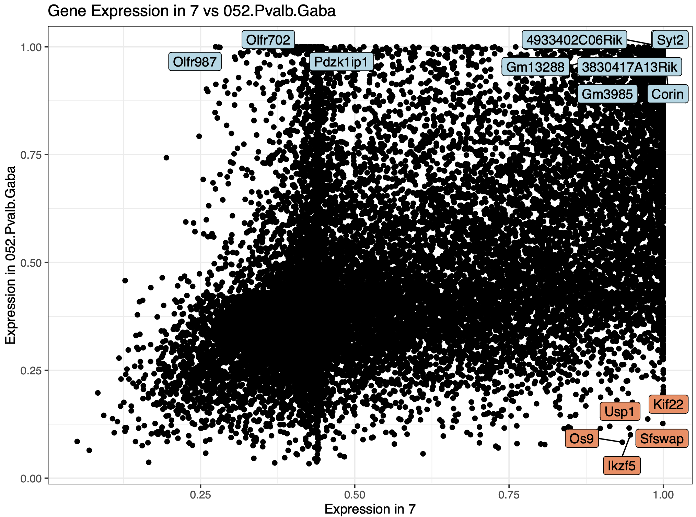

<!-- README.md is generated from README.Rmd. Please edit that file -->

# SAHA

<!-- badges: start -->

<!-- badges: end -->

<u>S</u>emi-<u>a</u>utomated <u>H</u>and <u>A</u>nnotation for Single
Cell and Spatial Datasets


## Installation

### Dependencies
* ComplexHeatmap
* circlize
* dplyr
* methods
* ggrepel
* eulerr
* reshape2
* corrplot
* ggpubr
* ape
* vegan
* dendextend
   
### Install development version from github using devtools

You can install the development version of SAHA like so:

``` r
#This is just a placeholder... if you'd like to user please reach out to Dom for the .Rproj files so you can compile in RStudio prior to releasex
library(devtools)
devtools::install_github("neurogenetics/SAHA")
```

## Required Files

In order to run SAHA, you may load in the following:

* Query_Markers: a dataframe output of Seurat::FindAllMarkers() from
your unannotated data

* Query_AvgExp: a dataframe output of Seurat::AverageExpression() from
your unannotated data

* Database_Markers: a dataframe output of Seurat::FindAllMarkers() from
a database of interest

* Database_AvgExp: a dataframe output of Seurat::AverageExpression()
from a database of interest

At least one pair must be present --\> Markers (Marker-based SAHA),
AvgExp (Marker-free SAHA). However you may also load both in the same
SAHA object.

## Quickstart

``` r
library(SAHA)
#> Thank you for using SAHA. If you enjoy this package, please consider citing Acri et al., (XXXX) bioRxiv.
data("ABC_meta")
data("CB_Markers")#Allen Brain Atlas Markers from Cerebellum
data("CB_AvgExp")#Allen Brain Atlas AvgExp from Cerebellum
query_Markers = read.csv("/path/to/your/file.csv") #your marker data
query_AvgExp = read.csv("/path/to/your/file.csv") #your avgexp data
## Quickstart to Marker-based dotplot
SAHA(query = query_Markers, db = CB_Markers,meta = meta, data_type = "Markers")
#Quickstart to Marker-free heatmap
SAHA(query = query_AvgExp, db = CB_AvgExp,meta = meta, data_type = "AvgExp")
```


## Vignette (in-progress)

### Create Object
``` r
library(SAHA)
#> Thank you for using SAHA. If you enjoy this package, please consider citing Acri et al., (XXXX) bioRxiv.
data("ABC_meta")
data("CB_Markers")#Allen Brain Atlas Markers from Cerebellum
data("CB_AvgExp")#Allen Brain Atlas AvgExp from Cerebellum
query_Markers = read.csv("/path/to/your/file.csv") #your marker data
query_AvgExp = read.csv("/path/to/your/file.csv") #your avgexp data
## Create SAHA object (only markers)
ann=Create_SAHA_object(query = query_Markers,db = CB_Markers,data_type = "Markers")
ann=Create_SAHA_object(query = query_AvgExp,db = CB_AvgExp,data_type = "AvgExp",existing = ann)
ann
#> SAHA 
#>   Data Type: Markers & AvgExp 
#>   Description: 26759 avgexp query (45 clusters)
#>                32285 avgexp db (28 possible annotations)
#>                6688 query markers (44 clusters)
#>                17615 database markers (28 possible annotations)
#>   Analysis: none
```

``` r
#Initialize Markers (suggested cutoffs)
ann=Initialize_Markers(ann)
#plots
Marker_Diversity(ann)
Marker_Richness(ann)
#Dummy variable features, put in the real one from a Seurat object
#varfeat=VariableFeatures(seurat_obj)
varfeat=ann@ann1$query[1:10,"gene"]
#print the plot?
Marker_Richness(ann,varfeat = varfeat)
```


### Tuning markers

``` r
#Tune Markers to top 100 by FC (db top 100, query top 25%-ile for demonstration)
ann=Tune_Markers(ann = ann,method = "absolute",method_value = 100,method_var = "avg_log2FC",set = "db")
ann=Tune_Markers(ann = ann,method = "relative",method_value = 0.75,method_var = "avg_log2FC",set = "query")
```

I need an image that describes how and why to clip markers....
Tuned markers....
``` r
#Initialize Markers (suggested cutoffs)
ann=Initialize_Markers(ann)
#plots
Marker_Diversity(ann)
Marker_Richness(ann)
#Dummy variable features, put in the real one from a Seurat object
#varfeat=VariableFeatures(seurat_obj)
varfeat=ann@ann1$query[1:10,"gene"]
#print the plot?
Marker_Richness(ann,varfeat = varfeat)
```


### Full Self-similarity pipeline
Will remove and add to vignette upon package release
``` r
###self sim
ann=Initialize_Self_Similiarity(ann,slot = "Markers")
ann=Create_SelfSimilarity_Viz(ann,slot = "Markers")
call_SAHA_plots(ann, plot_type = "self-similarity",data_type = "Markers")
#The size of genes will scale with time this takes
ann=Initialize_Self_Similiarity(ann,slot = "AvgExp")
#Not so here
ann=Create_SelfSimilarity_Viz(ann,slot = "AvgExp")
call_SAHA_plots(ann, plot_type = "self-similarity",data_type = "AvgExp")


Investigate_Self_Similarity(ann,cluster1 = 1, cluster2 = 10)
shared_marker_df=Investigate_Self_Similarity(ann,cluster1 = 1, cluster2 = 10,shared_df = TRUE)
head(shared_marker_df)

```


### Full Marker-based pipeline
Will remove and add to vignette upon package release

``` r
#Marker-based
ann=Run_Marker_Based(ann)
#Need to make sure this works without meta AND facet = F
#Maybe also be able to choose the facet level...
#Need to see if we can make facet be proportional in size...
#needs to work without meta
ann=Create_MarkerBased_Viz(ann)
#in the meantime
ann=Create_MarkerBased_Viz(ann,meta = meta,facet = TRUE)
call_SAHA_plots(ann, plot_type = "Marker-based",data_type = "Markers")

```

Split up and figs for each...

``` r
Investigate_Marker_Based(ann,query_cluster = 6,plot = "stacked")
Investigate_Marker_Based(ann,query_cluster = 6,plot = "venn",db_cell_type = "319 Astro TE NN")
```


### Full Marker-free pipeline
Will remove and add to vignette upon package release

``` r
#Make error message if it is empty...
ann=Initialize_MarkerFree(ann = ann)
#Need to add in option to downsample by a list..
ann=Downsample(ann)
#> Downsampled query and database contain 21665 genes.
ann=NormalizeDS(ann,assay_query = "RNA")
#This one does not
ann=CorrelateDS(ann)
ann=Create_MarkerFree_Viz(ann,facet = TRUE,meta = meta, ABC = TRUE, chemistry = "10Xv3")

call_SAHA_plots(ann, plot_type = "Marker-free",data_type = "AvgExp")
```


``` r
Investigate_MarkerFree(ann = ann,query_cluster = 31,db_cell_type = "327.Oligo.NN")
```



### Getting Annotations & SAHA to Seurat
Will remove and add to vignette upon package release
#### Auto Annotations
``` r
#Auto-annotate!!
#needs to return all query REGARDLESS OF BEST MATCH (especially for Markers)
auto=AutoAnnotate(ann,data_type = "Markers")
auto=AutoAnnotate(ann,data_type = "AvgExp")
#Need a better way to give consensus... like "close" consensus...
#error here if there is not both ann results!!
auto=AutoAnnotate(ann,data_type = "Both")

```


#### Semi-Auto Annotations


``` r
#Semi-auto annotate; need to be able to exit
semi_auto=SemiAutoAnnotate(ann,data_type = "Both")
#> What would you like to name cluster 43: 
```


#### Refine: Auto -> Semi-Auto Annotations
``` r
auto=AutoAnnotate(ann,data_type = "Both")
semi_auto=SemiAutoAnnotate(ann,data_type = "Both")
#> What would you like to name cluster 43: 
```


#### Transferring cluster names to Seurat
``` r
###TBD
```
