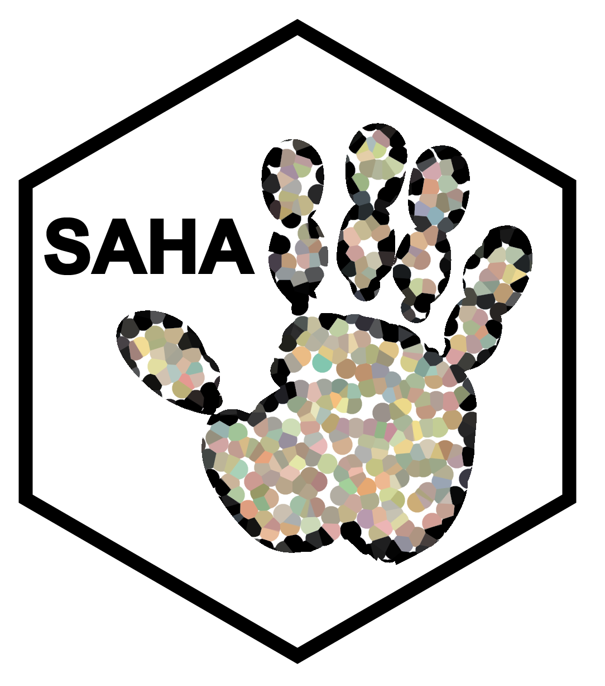

<!-- README.md is generated from README.Rmd. Please edit that file -->

# SAHA

<!-- badges: start -->

<!-- badges: end -->

<u>S</u>emi-<u>a</u>utomated <u>H</u>and <u>A</u>nnotation for Single
Cell and Spatial Datasets



SAHA is a user-friendly package with simple meta-data level input resulting in easy-to-understand exploration of cell annotation in single cell and spatial RNA sequencing datasets. Using either marker gene or average experession dataframes, the user has the option to compare the similarity of their <i>unannotated</i> clusters to <b>any</b> annotations in the literature.

<b>IMPORTANTLY:</b> This approach differs from label-transfer and integration-based approaches in that it does not require a large Seurat, SCE, Anndata, or any common data type in which the computational burden of the pipeline scales with the size of an object. Most (if not all) data fed into SAHA will be able to run on a laptop without the need for high-RAM devices or supercomputers.

Whether you can run every single cell package ever released or just finished your first single cell vignette, SAHA offers the options to <b>Create</b>, <b>Investigate</b>, or <b>Refine</b> cell annotations based on:
* Self-similarity: likeness of clusters within your query data
* Marker-based: presence of markers in a known database
* Marker-free: expression of <b>non-marker genes</b> in your data

## Installation

### Dependencies
* ComplexHeatmap
* circlize
* dplyr
* methods
* ggrepel
* eulerr
* reshape2
* corrplot
* ggpubr
* ape
* vegan
* dendextend
   
### Install development version from github using devtools

You can install the development version of SAHA like so:

``` r
#This is just a placeholder... if you'd like to user please reach out to Dom for the .Rproj files so you can compile in RStudio prior to releasex
library(devtools)
devtools::install_github("neurogenetics/SAHA")
```
Upon stable release, instructions for CRAN installation will be posted here.

## Required Files

In order to run SAHA, you may load in the following:

* Query_Markers: a dataframe output of Seurat::FindAllMarkers() from
your unannotated data

* Query_AvgExp: a dataframe output of Seurat::AverageExpression() from
your unannotated data

* Database_Markers: a dataframe output of Seurat::FindAllMarkers() from
a database of interest

* Database_AvgExp: a dataframe output of Seurat::AverageExpression()
from a database of interest

At least one pair must be present --\> Markers (Marker-based SAHA),
AvgExp (Marker-free SAHA). However you may also load both in the same
SAHA object.

### The "Database"
To aid with your annotation journey, we have added pre-prepared Markers and AvgExp dataframes from each of the regions in the Allen Brain Cell Atlas (mouse only, CITE CITE CITE). We have prepared from objects found on the Allen Brain's website (LINK) as of (DATE).

These are loaded in package data and may be loaded in with data(ROI_Markers) or data(ROI_AvgExp). For a full list of pre-loaded databases please see SAHA WITH ABC vignette.

However, we (the creators of SAHA) recognize that this may not match your data. You have the freedom to input any similarly-structured dataframes if you'd like to run against a database of your choice. In this way, you may select annotations from a previous study, another online database, or your own DIY database. For more information on how to run custom databases please visit our SAHA WITH CUSTOM DATABASE vignette.

## Quickstart

For those wanting a one-click annotation, quickstart options will output the summary level results of either Marker-based or Marker-free analysis.

``` r
library(SAHA)
#> Thank you for using SAHA. If you enjoy this package, please consider citing Acri et al., (XXXX) bioRxiv.
data("ABC_meta")
data("CB_Markers")#Allen Brain Atlas Markers from Cerebellum
data("CB_AvgExp")#Allen Brain Atlas AvgExp from Cerebellum
query_Markers = read.csv("/path/to/your/file.csv") #your marker data
query_AvgExp = read.csv("/path/to/your/file.csv") #your avgexp data
## Quickstart to Marker-based dotplot
SAHA(query = query_Markers, db = CB_Markers,meta = meta, data_type = "Markers")
#Quickstart to Marker-free heatmap
SAHA(query = query_AvgExp, db = CB_AvgExp,meta = meta, data_type = "AvgExp")
```


## Vignette (in-progress)

### Create Object
Start by loading your data into a SAHA object:

``` r
library(SAHA)
#> Thank you for using SAHA. If you enjoy this package, please consider citing Acri et al., (XXXX) bioRxiv.
data("ABC_meta")
data("CB_Markers")#Allen Brain Atlas Markers from Cerebellum
data("CB_AvgExp")#Allen Brain Atlas AvgExp from Cerebellum
query_Markers = read.csv("/path/to/your/file.csv") #your marker data
query_AvgExp = read.csv("/path/to/your/file.csv") #your avgexp data
## Create SAHA object (only markers)
ann=Create_SAHA_object(query = query_Markers,db = CB_Markers,data_type = "Markers")
ann=Create_SAHA_object(query = query_AvgExp,db = CB_AvgExp,data_type = "AvgExp",existing = ann)
ann
#> SAHA 
#>   Data Type: Markers & AvgExp 
#>   Description: 26759 avgexp query (45 clusters)
#>                32285 avgexp db (28 possible annotations)
#>                6688 query markers (44 clusters)
#>                17615 database markers (28 possible annotations)
#>   Analysis: none
```

Your Markers or AvgExp will be stored in ann@query and ann@db without any alteration. If you subset or initalize your markers in a way that doesn't give you desired results, rerun from this point without creating a new object.

``` r
#Initialize Markers (suggested cutoffs)
ann=Initialize_Markers(ann)
#plots
Marker_Diversity(ann)
Marker_Richness(ann)
#Dummy variable features, put in the real one from a Seurat object
#varfeat=VariableFeatures(seurat_obj)
varfeat=ann@ann1$query[1:10,"gene"]
#print the plot?
(ann,varfeat = varfeat)
```


### Tuning markers
Every single cell or spatial dataset is unique. You have already made many decisions that affect the quality of your data (isolation preparation, library creation, normalization/integration across samples). You have to make one more decision... <i>what is a marker gene</i>. Unfortunately we cannot make this decision for you, however we recommend keeping your search space large (database information) and your query space small (your data).

If you do not know where to start, we recommend the following:
* Use absolute cutoffs to limit how many features define an annotation in the database (top 100 markers by log2FC in your database of interest)
* Use relative cutoffs to limit what you consider to be a marker in your dataset (top 25%-ile by log2FC in your dataset to be annotated)

``` r
#Tune Markers to top 100 by FC (db top 100, query top 25%-ile for demonstration)
ann=Tune_Markers(ann = ann,method = "absolute",method_value = 100,method_var = "avg_log2FC",set = "db")
ann=Tune_Markers(ann = ann,method = "relative",method_value = 0.75,method_var = "avg_log2FC",set = "query")
```

One way to investigate whether or not you made a decision is to investigate what we call "diversity" and "richness":
* Diversity: Shannon Diversity Index (CITE) to identify high- or low- diversity clusters
   * High Diversity: Clusters with diverse markers may contain many markers to various cell types
   * Low Diversity: Clusters with low-diversity markers may be hard to annotate based on lack of unique identity
* Richness: Number of markers
   * Many markers: Indicates your "Cluster-of-interest VS. ALL" calculation yielded many differences
   * Few markers: Indicates your "Cluster-of-interest VS. ALL" calculation yieled not much different from every other cell
   * Low markers in varfeat: Most clustering algorithms require the input of variable features (LINK) so if a cluster's markers do not contain many varfeats your dimensionality reduction and cluster identification it could indicate overclustering & debris- or ambient- signals.

``` r
#Initialize Markers (suggested cutoffs)
ann=Initialize_Markers(ann)
#plots
Marker_Diversity(ann)
Marker_Richness(ann)
#Dummy variable features, put in the real one from a Seurat object
#varfeat=VariableFeatures(seurat_obj)
varfeat=ann@ann1$query[1:10,"gene"]
#print the plot?
Marker_Richness(ann,varfeat = varfeat)
```
Varfeat cannot be calculated from the dataframes input into SAHA alone. These must be saved separately from your single cell data object and input as a string of gene names. For demonstration here, we pick 10 random genes. Your varfeat object will likely be either 2000 or 5000 genes.

### Full Self-similarity pipeline
<u>Will remove and add to vignette upon package release</u>

To some extent, self-similarity has already been determined in your dataset. However, over-interpreting distance in two dimensions (PCA, tSNE, UMAP) is heavily frowned upon for annotation (CITE CITE CITE). Remember that reduced dimensions are just that... reductions. They are randomly signed (+/-) and scaled to your data (-1 and 1 might be just as "far" as -100 and 100 given prior decisions concerning data processing). <i>"Are cluster 1 and cluster 10 similar?"</i>, don't take a reduction... look at the <b>data</b>.

``` r
###self sim
ann=Initialize_Self_Similiarity(ann,slot = "Markers")
ann=Create_SelfSimilarity_Viz(ann,slot = "Markers")
call_SAHA_plots(ann, plot_type = "self-similarity",data_type = "Markers")
#The size of genes will scale with time this takes
ann=Initialize_Self_Similiarity(ann,slot = "AvgExp")
#Not so here
ann=Create_SelfSimilarity_Viz(ann,slot = "AvgExp")
call_SAHA_plots(ann, plot_type = "self-similarity",data_type = "AvgExp")


Investigate_Self_Similarity(ann,cluster1 = 1, cluster2 = 10)
shared_marker_df=Investigate_Self_Similarity(ann,cluster1 = 1, cluster2 = 10,shared_df = TRUE)
head(shared_marker_df)

```


For markers this similarity can be quantified as "shared markers" (if cluster 1 and cluster 10 both contain 200 of the same markers, "shared markers" = 200). For AvgExp a correlation between min-max scaled expression indicate high similarity (cluster1-GeneX = 99th percentile + cluster10-GeneX = 99th percentile == correlated).

You will notice significant disparity in AvgExp correlation in targeted or downsampled datasets. However if whole-transcriptome data is analyzed, it is likely the only correlation for all 20k some genes will only reveal correlation between self (cluster1-cluster1).

### Full Marker-based pipeline
<u>Will remove and add to vignette upon package release</u>

<b>For whole-transcriptome data, Marker-based annotation is recommended.</b> Over-representation analysis (or enrichment) of markers in each cluster (y-axis) to annotations (x-axis) will reveal which known cell type identities are likely to describe your data.

``` r
#Marker-based
ann=Run_Marker_Based(ann)
#Need to make sure this works without meta AND facet = F
#Maybe also be able to choose the facet level...
#Need to see if we can make facet be proportional in size...
#needs to work without meta
ann=Create_MarkerBased_Viz(ann)
#in the meantime
ann=Create_MarkerBased_Viz(ann,meta = meta,facet = TRUE)
call_SAHA_plots(ann, plot_type = "Marker-based",data_type = "Markers")

```


* Left: All enrichments (significant, p < 0.05) and non-significant are plotted by default using the call_SAHA_plots() function shown above.
* Center: Only significant enrichments are available in ann@results$marker_based$dotplot_sig
* Right: Only significant enrichments are available in ann@results$marker_based$dotplot_best

<i>If a cluster has no significant enrichments please consult the troubleshooting page </i> (LINK).

Once annotations have been completed you may investigate the enrichment one of two ways:

``` r
Investigate_Marker_Based(ann,query_cluster = 6,plot = "stacked")
Investigate_Marker_Based(ann,query_cluster = 6,plot = "venn",db_cell_type = "319 Astro TE NN")
```


* Barplot: for a query cluster, dotplot will show how many markers (could) be in each group colored by how many markers are in each group.
* Venn: for a query cluster & a selected annotation, a venn diagram will show how many markers overlap and print their names in the console.

### Full Marker-free pipeline
<u>Will remove and add to vignette upon package release</u>

<b>For targeted or panel-based data, Marker-based annotation is recommended.</b> Many targeted approaches do not contain enough marker genes to make a clear decision. Given that these assays are sparse (read more HERE), even the inclusion of 1 marker for your cell-type of interest may not be covered at a depth where they will show up with marker calculations. <i>Instead</i> use all of the expression in your data object to search annotations.

It is critical that both your query and db dataframe are calculated the same way. This will allow different gene expression assays to be compared to each other (i.e. Image Based Hybridization assays vs. Sequencing-based assays). To ensure they are scaled properly please see the Data Preparation page (LINK).

``` r
ann=Initialize_MarkerFree(ann = ann)
ann=Downsample(ann)
#> Downsampled query and database contain 21665 genes.
ann=NormalizeDS(ann,assay_query = "RNA")
#This one does not
ann=CorrelateDS(ann)
ann=Create_MarkerFree_Viz(ann,facet = TRUE,meta = meta, ABC = TRUE, chemistry = "10Xv3")

call_SAHA_plots(ann, plot_type = "Marker-free",data_type = "AvgExp")
```


Additioanlly we have included options for any object to be downsampled to a set gene list. If one assay is whole-transcriptome, but the other is panel based the Downsampling will happen automatically. However, if you wish to annotated based on a specific set of genes you may include a custom_ds argument.

``` r
downsample_list = c("GeneX", "GeneY","GeneZ"...)
ann=Downsample(ann,custom_ds=downsample_list)
```
This option will alter your results, but can be particularly powerful if there are genes in a panel that you do not expect to contribute to cell identity (e.g. a 1000 gene panel with 500 genes expressed normally and 500 genes only expressed in a disease condition). In this example we would recommend removing the genes you want to test and only keep genes you expect to be in both your dataset and a normal wild-type condition.

You have the option to visualize a scatterplot of all downsampled genes in a cluster of interest vs an annotated cell type in the database.

``` r
Investigate_MarkerFree(ann = ann,query_cluster = 31,db_cell_type = "327.Oligo.NN")
```

The top 10 correlated genes (high in query and db) as well as top 10 outliers (only in query OR db) will be automatically labeled on the plot.


### Getting Annotations & SAHA to Seurat
<u>Will remove and add to vignette upon package release</u>

Annotation is often described as an "iterative process" involving literature search, reading through dozens of spreadsheets, and re-doing several times until the data makes biological sense. While the later point is specific to your study the former two points can be aided by quick visualizations and <b>semi-automated</b> annotation.

First, if you desire a one-click auto annotation... this option is available but we recommend extreme caution. 

#### Auto Annotations
``` r
#Auto-annotate!!
#needs to return all query REGARDLESS OF BEST MATCH (especially for Markers)
auto=AutoAnnotate(ann,data_type = "Markers")
auto=AutoAnnotate(ann,data_type = "AvgExp")
#Need a better way to give consensus... like "close" consensus...
#error here if there is not both ann results!!
auto=AutoAnnotate(ann,data_type = "Both")

```


If you chose to run both Marker-based and Marker-free pipelines on your data, you will note that there are several possibilities:
* INCONCLUSIVE - auto annotation yielded no results (see TROUBLESHOOTING for more info)
* DISAGREEMENT - Marker-based and Marker-free yielded two separate annotations
* MATCH - Marker-based and Marker-free yielded one best match!

#### Semi-Auto Annotations
SAHA gets it's name from the idea that a user's own eye (or hand) is needed to make some biological decisions. In this promptable function, you will see the results of SAHA on a per-cluster basis and be asked to write in your preferred annotation.

Please note - you do not have to choose the name on the screen. If a neuron cluster gets two GABA-ergic annotations, you may write "GABA", "Inhibitory Neuron", "Unknown", or any name you'd like.

``` r
#Semi-auto annotate; need to be able to exit
semi_auto=SemiAutoAnnotate(ann,data_type = "Both")
#> What would you like to name cluster 43: 
```


#### Refine: Auto -> Semi-Auto Annotations
If you do not want to prompt through each annotation, you have the option to run auto and semi-auto functions in succession, allowing the prompts to only show you the INCONCLUSIVE clusters.

``` r
auto=AutoAnnotate(ann,data_type = "Both")
semi_auto=SemiAutoAnnotate(ann,data_type = "Both")
#> What would you like to name cluster 43: 
```

#### Transferring cluster names to Seurat
``` r
###TBD
```
